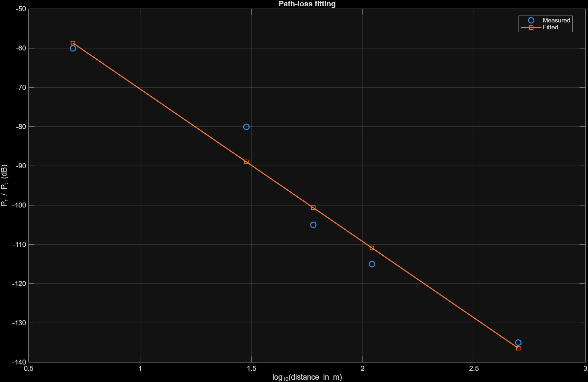

# Exercise 2.1

This exercise estimates the path-loss exponent `gamma` and the shadowing variance `sigma_phi_dB^2` from empirical measurements of `Pr/Pt` at `900 MHz`.

## Problem Setup

Given measurements:

| Distance from transmitter | `Pr / Pt` |
| --- | --- |
| 5 m | -60 dB |
| 30 m | -80 dB |
| 60 m | -105 dB |
| 110 m | -115 dB |
| 500 m | -135 dB |

Assumptions:

- Reference distance: `d0 = 1 m`
- Carrier frequency: `f = 900 MHz`
- Speed of light: `c = 3 x 10^8 m/s`
- Wavelength: `lambda = c / f = 1/3 m`

The reference constant `K` is determined by the free-space path-loss model:

\[
10 \log_{10} K = 20 \log_{10}\left(\frac{\lambda}{4 \pi d_0}\right)
\]

For this exercise:

\[
10 \log_{10} K \approx -31.5266 \text{ dB}
\]

## Model

The simplified path-loss and shadowing model in dB is

\[
\left(\frac{P_r}{P_t}\right)_{dB}
= 10 \log_{10} K - 10 \gamma \log_{10}\left(\frac{d}{d_0}\right) + \phi_{dB}
\]

Define

\[
x_i = \log_{10}\left(\frac{d_i}{d_0}\right), \qquad
y_i = \log_{10}\left(\frac{P_r}{P_t}\right)_i
\]

Then the model becomes

\[
y_i = \log_{10} K - \gamma x_i + \varepsilon_i
\]

where `phi_dB = 10 epsilon`.

## Least-Squares Estimation

The path-loss exponent is estimated by minimizing the mean squared error:

\[
\hat{\gamma}
= - \frac{\sum_{i=1}^{N} x_i \left(y_i - \log_{10} K\right)}
{\sum_{i=1}^{N} x_i^2}
\]

The residuals are

\[
\hat{\varepsilon}_i = y_i - \left(\log_{10} K - \hat{\gamma} x_i\right)
\]

and the shadowing term in dB is

\[
\hat{\phi}_{dB,i} = 10 \hat{\varepsilon}_i
\]

Using the MSE definition, the shadowing variance is estimated by

\[
\hat{\sigma}_{\phi_{dB}}^2
= \frac{1}{N} \sum_{i=1}^{N} \hat{\phi}_{dB,i}^2
\]

and the shadowing standard deviation is

\[
\hat{\sigma}_{\phi_{dB}} = \sqrt{\hat{\sigma}_{\phi_{dB}}^2}
\]

## MATLAB File

The implementation is provided in [Exercise_2_1.m](/d:/NYCU/class/Artificial%20Intelligence%20Wireless/NYCU-AI-Wireless-Communication-HW/Exercise_2.1/Exercise_2_1.m).

Run in MATLAB:

```matlab
Exercise_2_1
```

## Results

From the current script output:

- Estimated path-loss exponent: `gamma = 3.8870`
- Estimated shadowing standard deviation: `sigma_phi_dB = 4.8932 dB`
- Estimated shadowing variance: `sigma_phi_dB^2 = 23.9438 dB^2`

The fitted received-to-transmitted power values are approximately:

| Distance | Measured `Pr/Pt` | Fitted `Pr/Pt` |
| --- | --- | --- |
| 5 m | -60.0000 dB | -58.6954 dB |
| 30 m | -80.0000 dB | -88.9419 dB |
| 60 m | -105.0000 dB | -100.6428 dB |
| 110 m | -115.0000 dB | -110.8749 dB |
| 500 m | -135.0000 dB | -136.4347 dB |

## Output Figure

The measured data and fitted path-loss curve are shown below:


