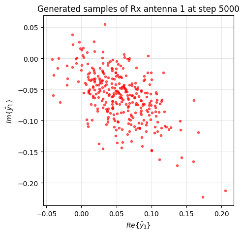
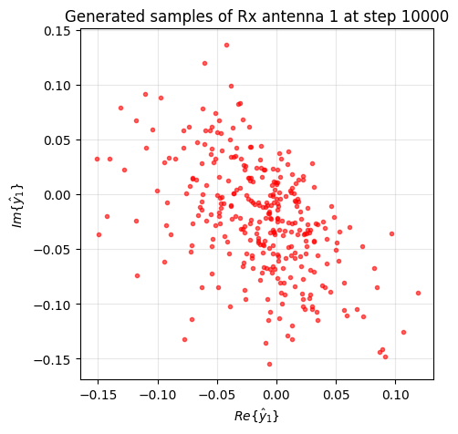
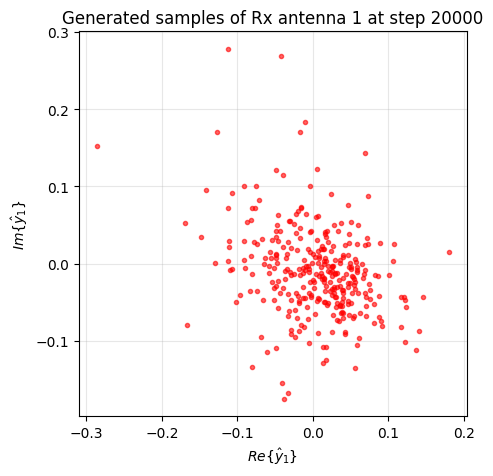
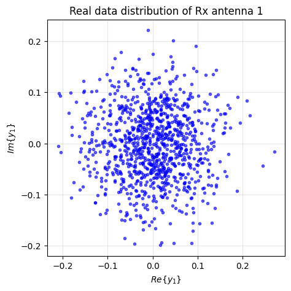

# Exercise 2.4(a)

This exercise uses QuaDRiGa to generate a realistic MIMO wireless channel for one specific configuration. QuaDRiGa supports geometry-based stochastic channel generation, MIMO modeling, and standardized scenarios such as 3GPP TR 38.901. In this implementation, we generate a 2 x 4 MIMO channel under the 3GPP_38.901_UMi_NLOS scenario.

## Problem Setup

The goal is to generate a realistic MIMO channel dataset for a specific wireless communication scenario using QuaDRiGa.

### Configuration

- Scenario: 3GPP_38.901_UMi_NLOS
- Carrier frequency: 3.5 GHz
- Number of transmit antennas: 4
- Number of receive antennas: 2
- UE speed: 3 km/h
- Number of channel snapshots: 20000
- BS position: [0; 0; 25]
- UE initial position: [100; 0; 1.5]
- UE trajectory: linear track

## Method

The implementation follows these steps:

1. Add the QuaDRiGa-main folder and all subfolders to the MATLAB path.
2. Verify that key QuaDRiGa classes are accessible:
   - qd_layout
   - qd_simulation_parameters
   - qd_arrayant
3. Create simulation parameters and set the center frequency.
4. Construct the layout and configure the transmitter and receiver arrays.
5. Define the UE linear trajectory and movement speed.
6. Select the 3GPP_38.901_UMi_NLOS scenario.
7. Generate channel coefficients using:
   - init_builder
   - gen_parameters
   - get_channels
8. Extract the raw multipath channel tensor h_coeff.
9. Sum over the path dimension to obtain a flat-fading MIMO channel h_mimo.
10. Save both the raw channel and processed MIMO channel into mimo_channel_dataset.mat.

## MATLAB File

The implementation is provided in [Exercise_2_4a.m](./Exercise_2_4a.m).

## Results

From the current script output:

* QuaDRiGa was successfully added to the MATLAB path
* The required QuaDRiGa constructors were correctly detected
* The selected scenario was 3GPP_38.901_UMi_NLOS
* The raw channel tensor size was 2 x 4 x 58 x 20000
* The flat-fading MIMO channel size was 2 x 4 x 20000
* The dataset was saved as mimo_channel_dataset.mat

This means:

* 2 receive antennas
* 4 transmit antennas
* 58 multipath components (before path summation)
* 20000 time snapshots

After summing over the multipath dimension, the final flat-fading channel dataset contains one 2 x 4 MIMO channel matrix for each of the 20000 snapshots.

### Console Output

```matlab
QuaDRiGa path added successfully.
D:\NYCU\class\Artificial Intelligence Wireless\NYCU-AI-Wireless-Communication-HW\Exercise_2_4\QuaDRiGa-main\quadriga_src\@qd_layout\qd_layout.m  % qd_layout constructor
D:\NYCU\class\Artificial Intelligence Wireless\NYCU-AI-Wireless-Communication-HW\Exercise_2_4\QuaDRiGa-main\quadriga_src\@qd_simulation_parameters\qd_simulation_parameters.m  % qd_simulation_parameters constructor
D:\NYCU\class\Artificial Intelligence Wireless\NYCU-AI-Wireless-Communication-HW\Exercise_2_4\QuaDRiGa-main\quadriga_src\@qd_arrayant\qd_arrayant.m  % qd_arrayant constructor
Scenario: 3GPP_38.901_UMi_NLOS
Generating 20000 snapshots for 2x4 MIMO...
Parameters   [oooooooooooooooooooooooooooooooooooooooooooooooooo]     0 seconds
Channels     [oooooooooooooooooooooooooooooooooooooooooooooooooo]    36 seconds
Raw channel size   : [2      4      58  20000]
Flat MIMO size     : [2      4  20000]
Dataset saved to mimo_channel_dataset.mat
```

###  Output File
The generated dataset file is:
* mimo_channel_dataset.mat

It contains:
* h_coeff: raw multipath MIMO channel coefficients

* h_mimo: processed flat-fading MIMO channel

# Exercise 2.4(b)

This exercise uses a GAN-based framework to model the MIMO channel generated in Exercise 2.4(a).  
The original Rayleigh/SISO conditional GAN is extended so that it can learn the received-signal distribution under a `2 x 4` MIMO channel generated by QuaDRiGa.

## Problem Setup

The goal is to adapt the GAN-based Rayleigh channel generator to the MIMO dataset generated in Exercise 2.4(a).

Instead of using a single complex channel coefficient `h`, the model now uses a MIMO channel matrix:

\[
H \in \mathbb{C}^{2 \times 4}
\]

For each training sample:

- The transmit vector is `x ∈ C^(4×1)`
- The received vector is `y = Hx + n ∈ C^(2×1)`

where:

- `H` is a MIMO channel snapshot from `h_mimo`
- `x` is a randomly generated QAM symbol vector
- `n` is additive Gaussian noise

## Method

The implementation follows these steps:

1. Load `mimo_channel_dataset.mat` generated in Exercise 2.4(a).
2. Extract `h_mimo` with shape `2 x 4 x 20000`.
3. Randomly sample one MIMO channel snapshot `H`.
4. Randomly generate a `4 x 1` transmit vector using 16-QAM symbols.
5. Simulate the received signal using

\[
y = Hx + n
\]

6. Convert the complex received vector into a real-valued training sample:

\[
[Re(y_1), Re(y_2), Im(y_1), Im(y_2)]
\]

7. Construct the conditioning vector from the transmitted symbols and channel coefficients:

\[
[Re(x), Im(x), Re(H), Im(H)]
\]

8. Train a conditional GAN using the generated real samples and conditioning vectors.
9. Save model checkpoints and generated sample figures during training.

## Python File

The implementation is provided in [Exercise_2_4b.py](./Exercise_2_4_b.py).

## Training Configuration

The main training settings are:

- Dataset file: `mimo_channel_dataset.mat`
- Channel variable: `h_mimo`
- Number of receive antennas: `2`
- Number of transmit antennas: `4`
- QAM modulation: `16-QAM`
- Training data size: `10000`
- Batch size: `512`
- Latent dimension: `16`
- Training iterations: `20000`
- Discriminator steps per iteration: `10`
- Noise variance: `0.01`

### Dimensions

- Generator output dimension: `4`
- Conditioning dimension: `24`

This corresponds to:

- `4` dimensions for the received signal:
  - `Re(y1), Re(y2), Im(y1), Im(y2)`
- `24` dimensions for the conditioning vector:
  - `Re(x)` and `Im(x)` for `4` transmit symbols → `8`
  - `Re(H)` and `Im(H)` for `2 x 4` channel coefficients → `16`

## Results

The model was successfully trained on the MIMO dataset generated in Exercise 2.4(a).

From the training output:

- The GAN was successfully trained for `20000` iterations.
- Model checkpoints were periodically saved.
- Generated sample figures were successfully exported.
- The discriminator and generator losses remained numerically stable throughout training.

### Training Log Observation

From the console output:

- `D_loss` stayed close to zero with small fluctuations.
- `G_loss` remained negative and changed gradually during training.
- No divergence or `NaN` values were observed.

This indicates that the adversarial training process was generally stable.

## Generated Sample Visualization

The following figures show generated samples of **Rx antenna 1** at different training steps.

### Step 5000



At step `5000`, the generated samples are still relatively scattered and loosely distributed.

### Step 10000



At step `10000`, the generated distribution becomes more concentrated and begins to exhibit a more stable structure.

### Step 20000



At step `20000`, the generated samples are more concentrated than in the earlier stages, indicating that the generator has learned a more stable received-signal distribution.

## Real Data Visualization

The real received-signal distribution for Rx antenna 1 is also saved during execution:



## Interpretation

Unlike a clean 16-QAM constellation diagram, the generated figures represent the **received-signal distribution** after the combined effects of:

- the MIMO channel matrix `H`
- transmitted QAM symbols
- additive Gaussian noise

Therefore, the generated samples form a noisy point cloud rather than ideal constellation points.

The progressive change from step `5000` to step `20000` shows that the CGAN gradually captures the statistical behavior of the received signal under the MIMO channel.

## Output Files

### Generated Figures

The generated figures are saved in:

- `ChannelGAN_MIMO_images/`

Example files:

- `generated_rx1_step_005000.png`
- `generated_rx1_step_010000.png`
- `generated_rx1_step_020000.png`
- `real_rx1.png`

### Saved Models

The trained model checkpoints are saved in:

- `Models/`

Example files:

- `ChannelGAN_MIMO_step_17000.ckpt.data-00000-of-00001`
- `ChannelGAN_MIMO_step_17000.ckpt.index`
- `ChannelGAN_MIMO_step_17000.ckpt.meta`
- `ChannelGAN_MIMO_step_18000.ckpt.data-00000-of-00001`
- `ChannelGAN_MIMO_step_18000.ckpt.index`
- `ChannelGAN_MIMO_step_18000.ckpt.meta`
- `ChannelGAN_MIMO_step_19000.ckpt.data-00000-of-00001`
- `ChannelGAN_MIMO_step_19000.ckpt.index`
- `ChannelGAN_MIMO_step_19000.ckpt.meta`
- `ChannelGAN_MIMO_step_20000.ckpt.data-00000-of-00001`
- `ChannelGAN_MIMO_step_20000.ckpt.index`
- `ChannelGAN_MIMO_step_20000.ckpt.meta`
- `ChannelGAN_MIMO_final.ckpt.data-00000-of-00001`
- `ChannelGAN_MIMO_final.ckpt.index`
- `ChannelGAN_MIMO_final.ckpt.meta`

## Conclusion

In this exercise, the original Rayleigh/SISO GAN framework was successfully extended to a MIMO setting using the channel dataset generated by QuaDRiGa.

The results show that:

- the MIMO channel dataset can be successfully integrated into a conditional GAN framework,
- the generator can learn the received-signal distribution under a `2 x 4` MIMO channel,
- and the generated samples become more stable as training proceeds.

This completes the GAN-based modeling of the MIMO channel generated in Exercise 2.4(a).