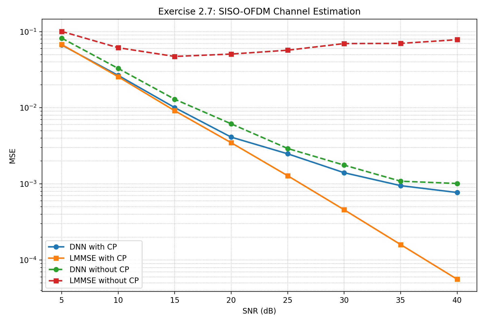
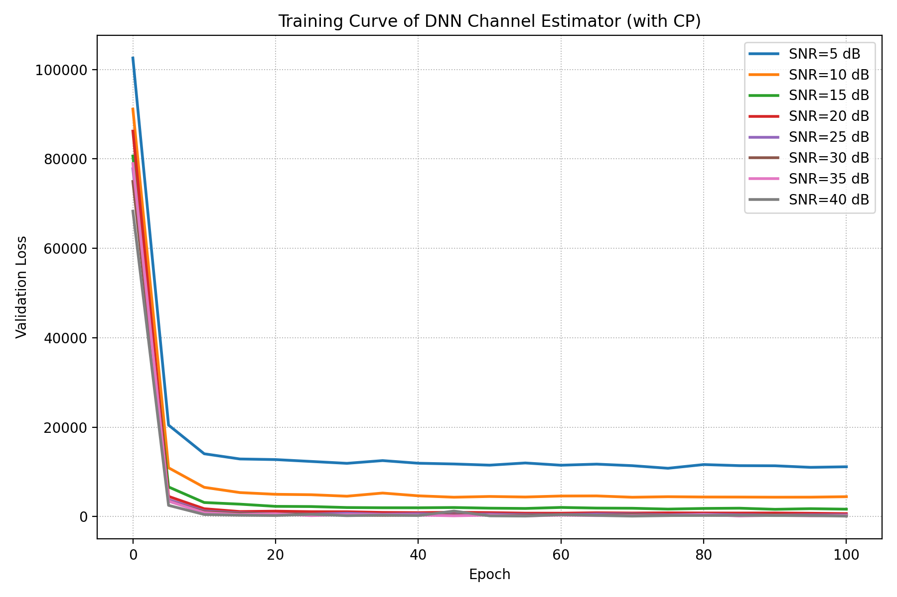
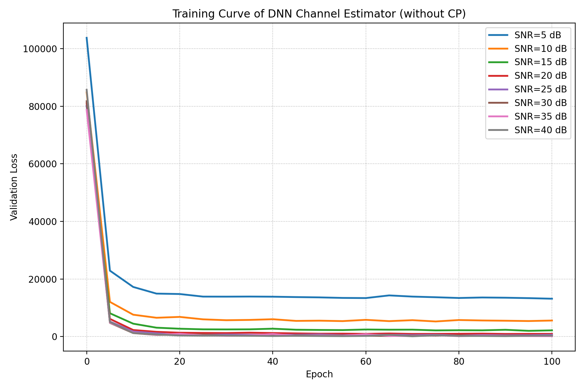

# Exercise 2.7: Data-Driven SISO-OFDM Channel Estimation

This project reproduces the SISO-OFDM channel estimation experiment in **Exercise 2.7**. It compares a **DNN-based channel estimator** and an **LMMSE channel estimator** in two settings:

- with CP
- without CP

The target is to reproduce the qualitative behavior of **Figure 2.9** in the homework.

## Overview

System settings:

- Number of subcarriers: `64`
- Pilot symbol: first OFDM symbol with `64` QPSK pilots
- Data symbol: second OFDM symbol
- SNR range: `5 dB` to `40 dB`
- SNR step: `5 dB`
- Compared estimators: `DNN`, `LMMSE`
- Scenarios: with CP, without CP

Therefore, the project evaluates four cases:

- DNN with CP
- LMMSE with CP
- DNN without CP
- LMMSE without CP

## Project Structure

```text
Exercise_2_7
├── main.py
├── plot_results.py
├── plot_training_curves.py
├── figure_2_9_reproduced.png
├── training_curve_with_cp.png
├── training_curve_without_cp.png
├── MSE_dnn_4QAM.mat
├── MSE_mmse_4QAM.mat
├── MSE_dnn_4QAM_CP_FREE.mat
├── MSE_mmse_4QAM_CP_FREE.mat
├── dnn_ce/
└── tools/
    ├── generate_channel_dataset.py
    ├── networks.py
    ├── raputil.py
    ├── channel_train.npy
    └── channel_test.npy
```

## Dataset Note

The original public repository did not provide:

- `tools/channel_train.npy`
- `tools/channel_test.npy`

So this project adds `tools/generate_channel_dataset.py` to generate a compatible dataset for training and evaluation.

Generated channel characteristics:

- 16-tap complex Rayleigh fading channels
- Exponential power-delay profile
- Per-sample normalization

This makes the whole pipeline runnable, but the generated dataset is still a compatible replacement. Its distribution may not be exactly the same as the original private dataset used by the textbook or original author.

## Method

### DNN Channel Estimator

Implemented in `tools/networks.py`.

Architecture:

- Input: concatenation of pilot received signal `Yp` and pilot symbols `Xp`
- Hidden layer 1: `Dense(500, relu)`
- Hidden layer 2: `Dense(250, relu)`
- Output: real and imaginary parts of the estimated frequency-domain channel
- Loss: `tf.nn.l2_loss`

### LMMSE Channel Estimator

Implemented in `tools/raputil.py` through `MMSE_CE()`.

Main procedure:

- Obtain LS pilot estimate
- Construct channel correlation matrices
- Compute the LMMSE weighting matrix
- Estimate the frequency-domain channel

## Environment

This project was tested with:

- Python `3.11`
- TensorFlow `2.13.0`
- `tensorflow.compat.v1`
- Windows PowerShell / WSL-compatible execution

## How to Run

### 1. Activate Environment

```powershell
.\env\Scripts\Activate.ps1
```

### 2. Generate Channel Dataset

```powershell
python tools\generate_channel_dataset.py
```

Generated files:

- `tools/channel_train.npy`
- `tools/channel_test.npy`

### 3. Train DNN Models

With CP:

```powershell
python main.py --ce-type dnn --mode train --cp-flag true --training-epochs 100 --snrs 5 10 15 20 25 30 35 40
```

Without CP:

```powershell
python main.py --ce-type dnn --mode train --cp-flag false --training-epochs 100 --snrs 5 10 15 20 25 30 35 40
```

### 4. Plot DNN Training Curves

```powershell
python plot_training_curves.py
```

Generated files:

- `training_curve_with_cp.png`
- `training_curve_without_cp.png`

### 5. Evaluate MSE

DNN with CP:

```powershell
python main.py --ce-type dnn --mode test --cp-flag true --num-trials 200 --snrs 5 10 15 20 25 30 35 40
```

LMMSE with CP:

```powershell
python main.py --ce-type mmse --mode test --cp-flag true --num-trials 200 --snrs 5 10 15 20 25 30 35 40
```

DNN without CP:

```powershell
python main.py --ce-type dnn --mode test --cp-flag false --num-trials 200 --snrs 5 10 15 20 25 30 35 40
```

LMMSE without CP:

```powershell
python main.py --ce-type mmse --mode test --cp-flag false --num-trials 200 --snrs 5 10 15 20 25 30 35 40
```

### 6. Plot Final Result Figure

```powershell
python plot_results.py
```

Generated file:

- `figure_2_9_reproduced.png`

## Results

### Final MSE Comparison



Observations:

- Under the with-CP setting, both estimators improve as SNR increases.
- Under the with-CP setting, LMMSE achieves the best performance, especially at medium and high SNR.
- Under the without-CP setting, LMMSE degrades significantly and becomes worse at high SNR.
- Under the without-CP setting, the DNN estimator remains more stable and continues to improve with SNR.

These results reproduce the expected qualitative behavior:

- solid-line behavior with CP
- dashed-line behavior without CP

## Training Curves

### DNN with CP



### DNN without CP



Observations:

- Validation loss decreases rapidly during the first several epochs.
- Most models reach a relatively stable region after around 20-30 epochs.
- Higher-SNR settings generally converge to lower validation loss.
- The DNN is trainable in both CP and CP-free settings.

## Discussion

### Why does LMMSE perform best with CP?

With CP, the OFDM model matches the assumptions used by LMMSE well, so LMMSE becomes a very strong model-based baseline and achieves the lowest MSE.

### Why does LMMSE deteriorate without CP?

Without CP, inter-symbol interference breaks the ideal OFDM assumption. This causes model mismatch, so the LMMSE estimator becomes interference-limited at high SNR.

### Why is DNN more stable without CP?

The DNN does not rely on the same analytical assumptions as LMMSE. Instead, it learns the mapping from pilot observations to channel estimates directly from data, so it remains more robust when the system deviates from the ideal CP-based model.

## Conclusion

This project successfully reproduces the required qualitative behavior of Exercise 2.7.

Main conclusions:

- With CP, LMMSE performs best and matches theory.
- Without CP, LMMSE deteriorates because of ISI and model mismatch.
- The DNN is more robust in the CP-free setting, although it does not outperform LMMSE in the standard CP-enabled case.

Overall, the project provides a complete reproducible pipeline including:

- dataset generation
- DNN training
- MSE evaluation
- final result plotting
- training curve visualization

## Files Generated After Running

### Checkpoints

Stored in `dnn_ce/`:

- `CE_DNN_4QAM_SNR_5dB.npz`
- `...`
- `CE_DNN_4QAM_SNR_40dB.npz`
- `CE_DNN_CPFREE_4QAM_SNR_5dB.npz`
- `...`
- `CE_DNN_CPFREE_4QAM_SNR_40dB.npz`

### Result Files

- `MSE_dnn_4QAM.mat`
- `MSE_mmse_4QAM.mat`
- `MSE_dnn_4QAM_CP_FREE.mat`
- `MSE_mmse_4QAM_CP_FREE.mat`

### Figures

- `figure_2_9_reproduced.png`
- `training_curve_with_cp.png`
- `training_curve_without_cp.png`
