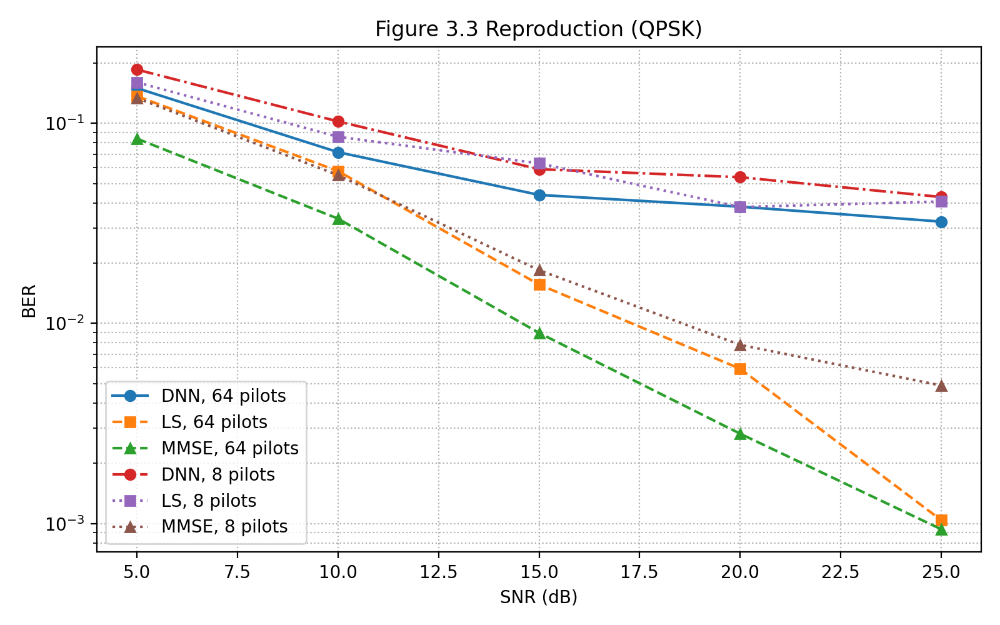
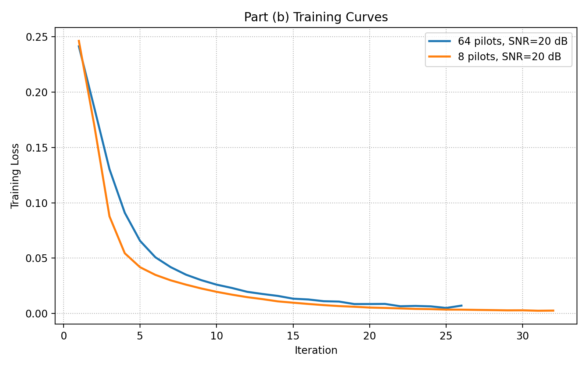
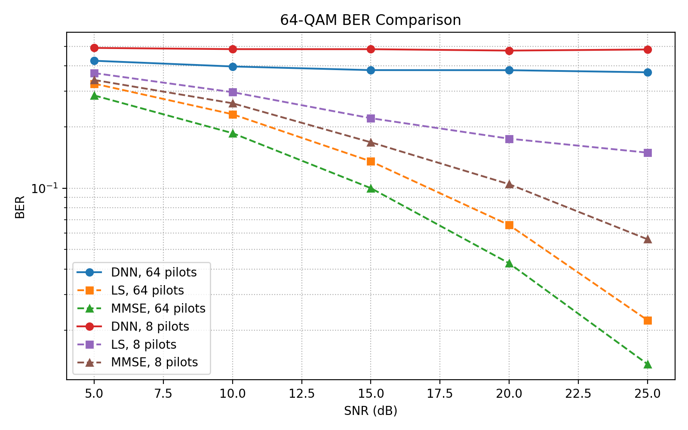
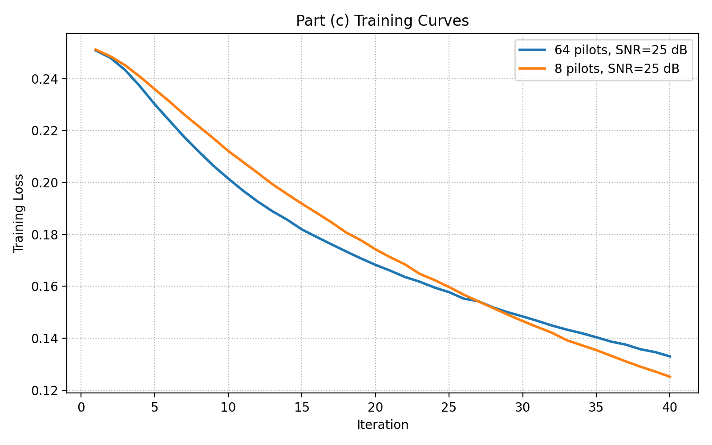
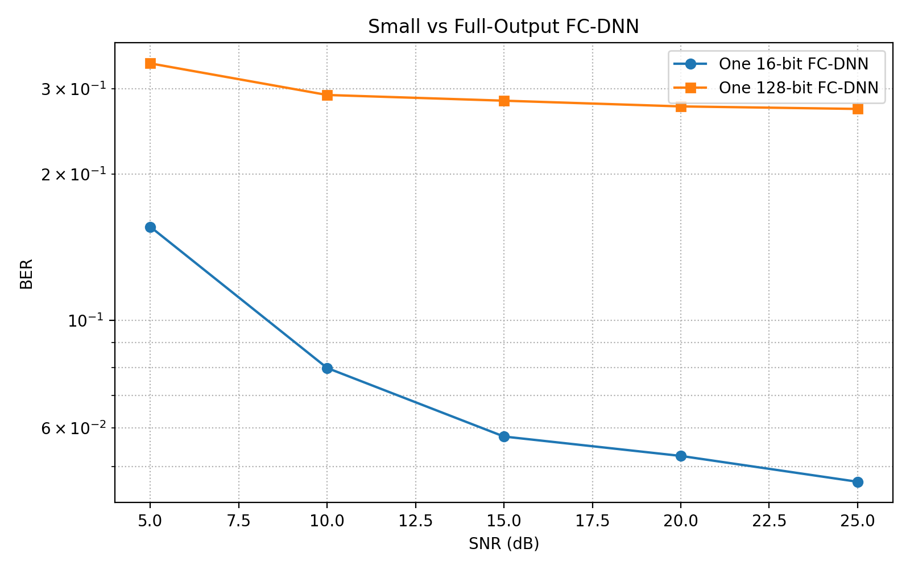
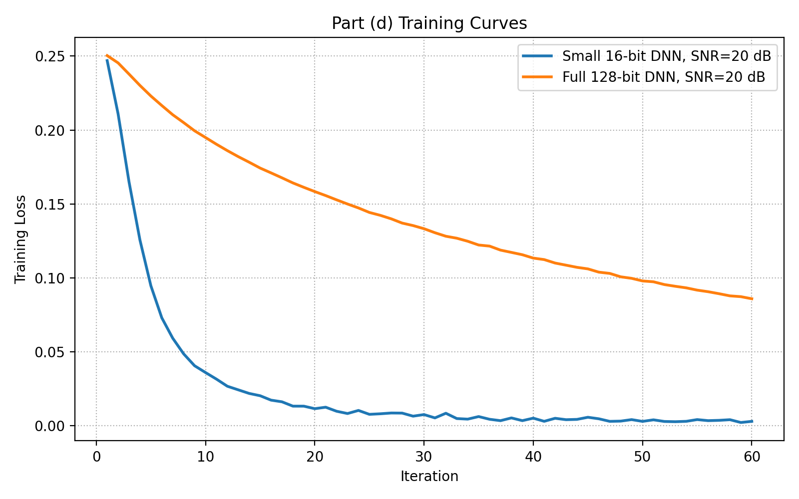

# Exercise 3.1 (b)(c)(d) Final Report

## Overview

This report summarizes the final reproducible results for Exercise 3.1 parts (b), (c), and (d) under the current environment.

The original repository code was designed for TensorFlow 1.1 and Python 2.7, and the copied starter code had two practical problems:

1. `DNN_Detection/utils.py` is not directly usable in the current environment.
2. The local `H_dataset/` folder initially contained only `README.txt`, not the actual channel data.

To complete the exercise, I:

1. Downloaded the original `haoyye/OFDM_DNN` repository and extracted its `H_dataset`.
2. Implemented a modern reproducible pipeline in [DNN_Detection/modern_repro.py](./DNN_Detection/modern_repro.py) using `numpy`, `matplotlib`, and `TensorFlow 2.x / tf.keras`.
3. Kept the OFDM framing logic consistent with the paper and used the original channel dataset split `1..300` for training channels and `301..400` for test channels.
4. Implemented DNN, LS, and MMSE comparisons and added grouped training-curve plots for each subproblem.

The current implementation is closer to the paper than the earlier `scikit-learn` version because the FC-DNN is now trained with TensorFlow. However, it is still not a bit-exact reproduction of the original `TensorFlow 1.1 + Python 2.7` workflow.

## Mathematical Background

The following equations are included only as supporting context for the simulation results in parts (b), (c), and (d).

### 1. OFDM frequency-domain received signal model

For the `k`-th subcarrier, the received symbol can be written as

```math
Y(k) = H(k)X(k) + W(k),
```

where `X(k)` is the transmitted symbol, `H(k)` is the channel frequency response, and `W(k)` is additive noise.

In vector form, the OFDM detection problem can be written as

```math
\mathbf{y} = \mathbf{H}\mathbf{x} + \mathbf{w}.
```

This is the basic model behind both channel estimation and symbol detection.

### 2. Least-squares channel estimation

At pilot subcarriers, the LS channel estimate is

```math
\hat{H}_{\mathrm{LS}}(k) = \frac{Y_p(k)}{X_p(k)},
```

where `X_p(k)` is the known pilot and `Y_p(k)` is the corresponding received pilot.

This explains why pilot density matters: with fewer pilots, the receiver has less direct channel information and the estimation problem becomes harder.

### 3. MMSE channel estimation

MMSE improves LS by using channel statistics and noise variance. A common form is

```math
\hat{\mathbf{H}}_{\mathrm{MMSE}}
=
\mathbf{R}_{HH}
\left(
\mathbf{R}_{HH} + \sigma_w^2 (\mathbf{X}^H \mathbf{X})^{-1}
\right)^{-1}
\hat{\mathbf{H}}_{\mathrm{LS}},
```

where `\mathbf{R}_{HH}` is the channel covariance matrix and `\sigma_w^2` is the noise variance.

In practice, MMSE usually outperforms LS because it exploits prior statistical information about the channel.

### 4. DNN input and output definition

In this exercise, the received pilot and data symbols are split into real and imaginary parts before being fed into the FC-DNN. Therefore, with `64` pilot/data samples in complex form, the input becomes

```math
128 \text{ complex values} \rightarrow 256 \text{ real-valued inputs}.
```

The output dimension depends on how many transmitted bits the DNN is asked to predict:

```math
\text{QPSK: } 2 \text{ bits/symbol}, \qquad
\text{64-QAM: } 6 \text{ bits/symbol}.
```

This directly explains why part (c) is harder than part (b), and why the single large-output model in part (d) is harder to train than multiple small-output models.

### 5. BER definition

The performance metric used in all plots is the bit error rate:

```math
\mathrm{BER} =
\frac{\text{number of erroneous bits}}{\text{total number of transmitted bits}}.
```

All BER curves in the report are empirical Monte Carlo estimates of this quantity.

## Final Run Used For This Report

The final reported numbers below are based on this command:

```powershell
C:\Users\York\.conda\envs\csinet_tf\python.exe DNN_Detection\modern_repro.py
```

So the final TensorFlow 2.x settings were:

1. Part (b), 64 pilots: `train_samples=12000`, `max_iter=80`
2. Part (b), 8 pilots: `train_samples=30000`, `max_iter=80`
3. Part (c), both pilot settings: `train_samples=8000`, `max_iter=40`
4. Part (d), small 16-bit DNN: `train_samples=8000`, `max_iter=60`
5. Part (d), full 128-bit DNN: `train_samples=8000`, `max_iter=60`
6. DNN backend: `TensorFlow 2.10.1`, `RMSprop(1e-3)`, `MSE loss`, hidden activations `ReLU`, output activation `Sigmoid`

## Part (b): Reproduce Figure 3.3

BER figure:



Training-curve figure:



BER results:

| SNR (dB) | DNN, 64 pilots | LS, 64 pilots | MMSE, 64 pilots | DNN, 8 pilots | LS, 8 pilots | MMSE, 8 pilots |
|---|---:|---:|---:|---:|---:|---:|
| 5  | 0.1495 | 0.1365 | 0.0836 | 0.1852 | 0.1599 | 0.1334 |
| 10 | 0.0716 | 0.0576 | 0.0333 | 0.1020 | 0.0855 | 0.0550 |
| 15 | 0.0438 | 0.0156 | 0.0090 | 0.0589 | 0.0630 | 0.0184 |
| 20 | 0.0383 | 0.0059 | 0.0028 | 0.0538 | 0.0381 | 0.0078 |
| 25 | 0.0323 | 0.0010 | 0.0009 | 0.0428 | 0.0406 | 0.0049 |

Discussion:

1. The BER curves have the correct qualitative trend: BER decreases as SNR increases.
2. With 64 pilots, MMSE is best, LS is second, and DNN also improves steadily with SNR.
3. With only 8 pilots, DNN is noticeably worse than the 64-pilot case, but it becomes competitive with LS at high SNR.
4. Even after switching the DNN backend from `scikit-learn` to TensorFlow, the DNN still does not reproduce the paper's "close to MMSE" performance. Therefore, this work should be described as a TensorFlow-based modern reimplementation with correct qualitative trends, not a strict numerical reproduction of Figure 3.
5. Training stability for part (b) is acceptable. Many DNN runs stop before the maximum iteration count, so part (b) is substantially better behaved than parts (c) and (d).

Additional tuning note for part (b):

1. I also tested larger training budgets in TensorFlow 2.x.
2. Example improvements:
   - 64 pilots, 20 dB: BER improved from about `0.0383` to `0.0218`
   - 8 pilots, 20 dB: BER improved from about `0.0538` to `0.0358`
3. However, even after tuning, the DNN still did not reach MMSE-level performance. This suggests that the remaining gap is not just a minor hyperparameter issue.

## Part (c): Replace QPSK With 64-QAM

BER figure:



Training-curve figure:



Final training setting for part (c):

1. `train_samples=8000`
2. `max_iter=40`
3. `hidden_layers=(500, 250, 120)`

BER results:

| SNR (dB) | DNN, 64 pilots | LS, 64 pilots | MMSE, 64 pilots | DNN, 8 pilots | LS, 8 pilots | MMSE, 8 pilots |
|---|---:|---:|---:|---:|---:|---:|
| 5  | 0.4241 | 0.3271 | 0.2862 | 0.4906 | 0.3688 | 0.3411 |
| 10 | 0.3976 | 0.2313 | 0.1866 | 0.4838 | 0.2970 | 0.2619 |
| 15 | 0.3815 | 0.1356 | 0.1000 | 0.4836 | 0.2211 | 0.1683 |
| 20 | 0.3811 | 0.0658 | 0.0427 | 0.4760 | 0.1753 | 0.1046 |
| 25 | 0.3721 | 0.0224 | 0.0136 | 0.4819 | 0.1497 | 0.0560 |

Discussion:

1. After changing from QPSK to 64-QAM, BER becomes much worse for all methods, which is expected because the constellation is denser and each symbol carries more bits.
2. This part now follows the exercise requirement more faithfully than before: the modulation is changed to `64-QAM`, while the FC-DNN hidden-layer structure remains the same as in part (b).
3. The DNN is much weaker than LS and MMSE in every 64-QAM setting, especially for 8 pilots.
4. All DNN runs in part (c) hit the maximum epoch count, so the model is clearly not well converged.
5. Therefore, the main finding for part (c) is that simply changing QPSK to 64-QAM while keeping the same architecture causes severe performance degradation. This directly supports the discussion that the original QPSK-oriented FC-DNN is not sufficient for the harder 64-QAM task.

## Part (d): One Large FC-DNN vs Small FC-DNNs

BER figure:



Training-curve figure:



Settings:

1. Small DNN:
   - output bits: 16
   - hidden layers: `(500, 250, 120)`
   - `train_samples=8000`
   - `max_iter=60`
2. Full DNN:
   - output bits: 128
   - hidden layers: `(1024, 512, 256)`
   - `train_samples=8000`
   - `max_iter=60`

BER results:

| SNR (dB) | Small 16-bit DNN | Full 128-bit DNN |
|---|---:|---:|
| 5  | 0.1558 | 0.3381 |
| 10 | 0.0798 | 0.2911 |
| 15 | 0.0576 | 0.2833 |
| 20 | 0.0526 | 0.2757 |
| 25 | 0.0465 | 0.2724 |

Discussion:

1. This part is now a fairer comparison than the earlier heavily tuned version because both models use the same `train_samples` and `max_iter`.
2. Under the same training budget, the single 128-bit DNN is much worse than the 16-bit DNN at every SNR point.
3. This supports the intended message of the exercise: predicting the whole bit vector with a single FC-DNN is substantially harder than decomposing the task into smaller subnetworks.
4. Therefore, for the current training budget, the multiple-small-network strategy is clearly more effective.

## Convergence Summary

1. Part (b) is the most stable and closest to convergence. Several runs stop before the maximum epoch count.
2. Part (c) is clearly under-trained. All 64-QAM runs hit the maximum epoch count and still have poor BER.
3. Part (d) shows that the full-output model is much harder to optimize than the small-output model when the training budget is fixed.
4. The training-curve figures should be used to support the convergence discussion in the report.

## Recommended Figures To Use In The Report

For the main body, use BER figures first:

1. `./figures/part_b_figure33_like.png`
2. `./figures/part_c_64qam.png`
3. `./figures/part_d_full_vs_small.png`

For convergence discussion, add:

1. `./figures/part_b_training_curves.png`
2. `./figures/part_c_training_curves.png`
3. `./figures/part_d_training_curves.png`

## Key Output Files

1. Code: [DNN_Detection/modern_repro.py](./DNN_Detection/modern_repro.py)
2. Combined summary: [results/summary.json](./results/summary.json)
3. Part (b): [results/part_b_results.json](./results/part_b_results.json)
4. Part (c): [results/part_c_results.json](./results/part_c_results.json)
5. Part (d): [results/part_d_results.json](./results/part_d_results.json)

## How To Run

### 1. Install dependencies

PowerShell:

```powershell
python -m pip install numpy scipy scikit-learn matplotlib pypdf
```

WSL / Linux:

```bash
python3 -m pip install numpy scipy scikit-learn matplotlib pypdf
```

### 2. Prepare the original channel dataset

Clone the original repository:

```bash
git clone https://github.com/haoyye/OFDM_DNN.git tmp_OFDM_DNN
```

If you are using WSL / Linux, merge and unzip:

```bash
cat tmp_OFDM_DNN/H_dataset/H_dataset.zip.001 \
    tmp_OFDM_DNN/H_dataset/H_dataset.zip.002 \
    tmp_OFDM_DNN/H_dataset/H_dataset.zip.003 \
    tmp_OFDM_DNN/H_dataset/H_dataset.zip.004 \
    > tmp_OFDM_DNN/H_dataset/H_dataset.zip
mkdir -p tmp_OFDM_DNN/H_dataset_extracted
unzip -o tmp_OFDM_DNN/H_dataset/H_dataset.zip -d tmp_OFDM_DNN/H_dataset_extracted
```

If you are using PowerShell, merge and unzip:

```powershell
$src = "tmp_OFDM_DNN\H_dataset"
$dst = Join-Path $src "H_dataset.zip"
$out = [System.IO.File]::Create($dst)
try {
  foreach ($part in "H_dataset.zip.001","H_dataset.zip.002","H_dataset.zip.003","H_dataset.zip.004") {
    $bytes = [System.IO.File]::ReadAllBytes((Join-Path $src $part))
    $out.Write($bytes, 0, $bytes.Length)
  }
} finally {
  $out.Dispose()
}
Expand-Archive -LiteralPath "tmp_OFDM_DNN\H_dataset\H_dataset.zip" -DestinationPath "tmp_OFDM_DNN\H_dataset_extracted" -Force
```

### 3. Run the default full experiment

```powershell
C:\Users\York\.conda\envs\csinet_tf\python.exe DNN_Detection\modern_repro.py
```

### 4. Run with custom train_samples and max_iter

Apply the same values to every DNN experiment:

```powershell
C:\Users\York\.conda\envs\csinet_tf\python.exe DNN_Detection\modern_repro.py --train-samples-all 12000 --max-iter-all 100
```

Final run used in this report:

```powershell
C:\Users\York\.conda\envs\csinet_tf\python.exe DNN_Detection\modern_repro.py
```

Show the full argument list:

```powershell
C:\Users\York\.conda\envs\csinet_tf\python.exe DNN_Detection\modern_repro.py --help
```

### 5. Main configurable arguments

1. `--train-samples-all`
2. `--max-iter-all`
3. `--part-b-train-samples-64`
4. `--part-b-train-samples-8`
5. `--part-b-max-iter`
6. `--part-c-train-samples`
7. `--part-c-max-iter`
8. `--part-d-small-train-samples`
9. `--part-d-small-max-iter`
10. `--part-d-full-train-samples`
11. `--part-d-full-max-iter`

If `--train-samples-all` is provided, it overrides all part-specific `train_samples`.
If `--max-iter-all` is provided, it overrides all part-specific `max_iter`.
