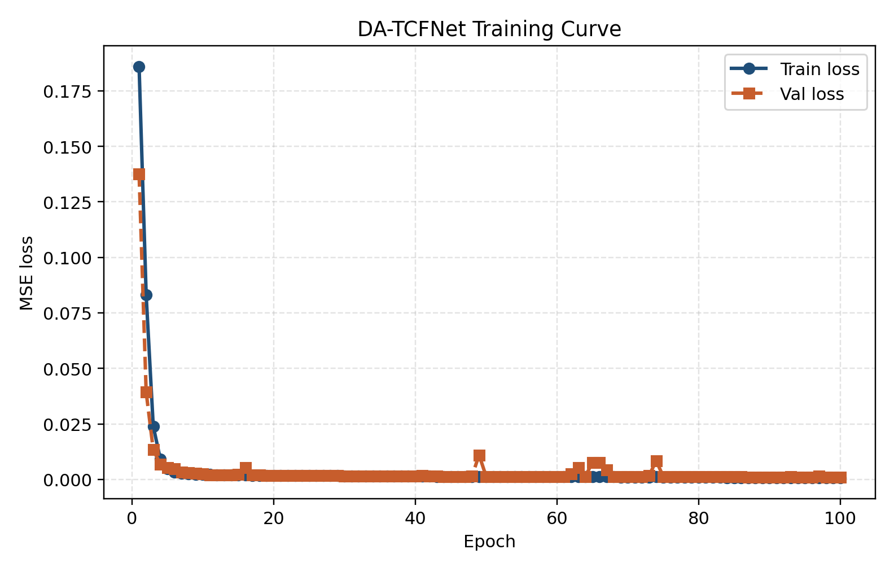
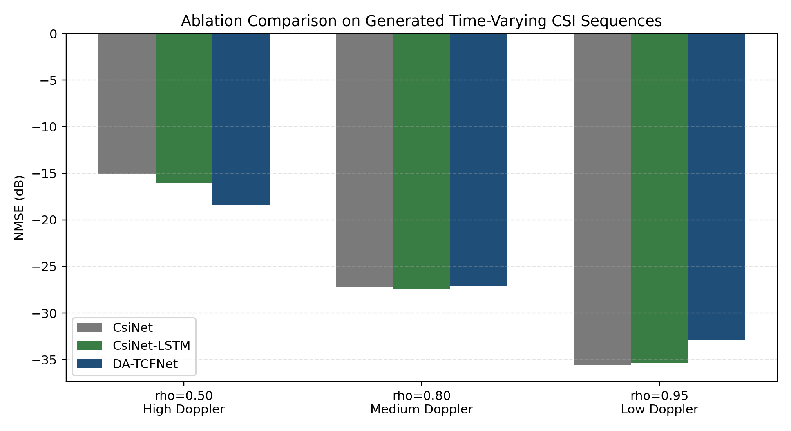
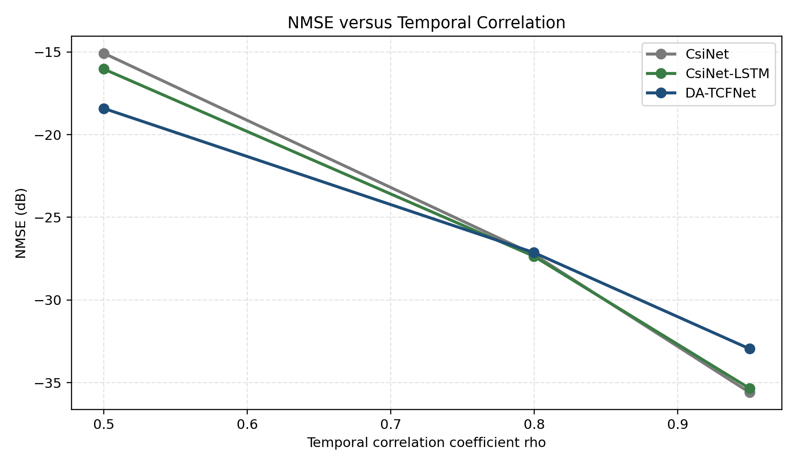
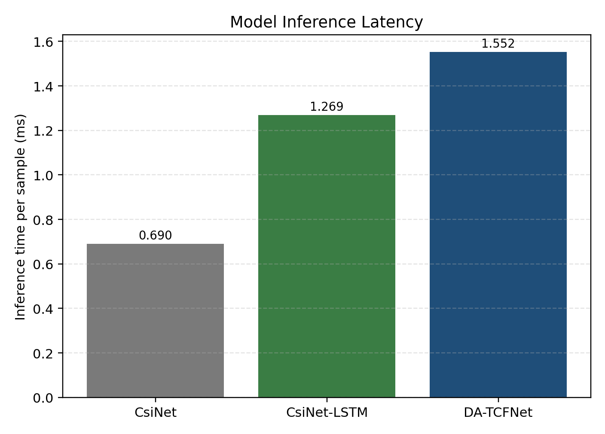
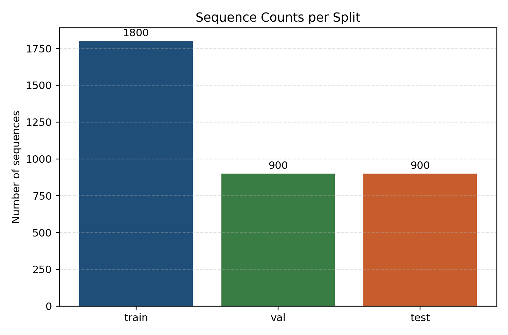
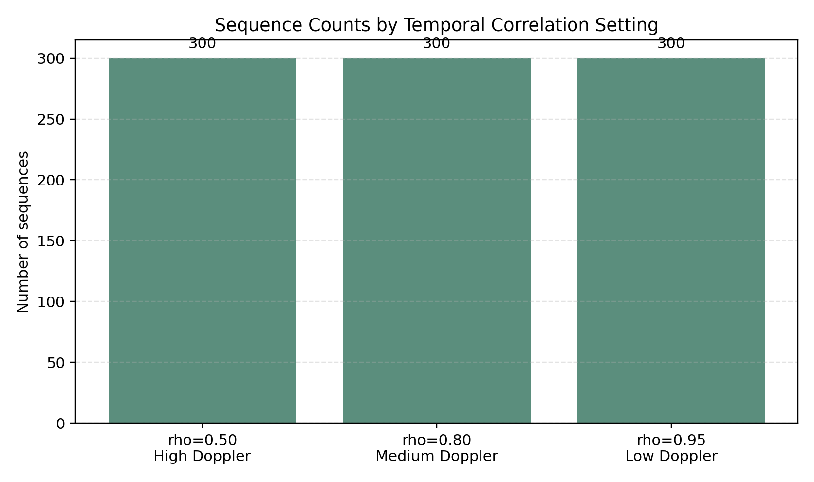
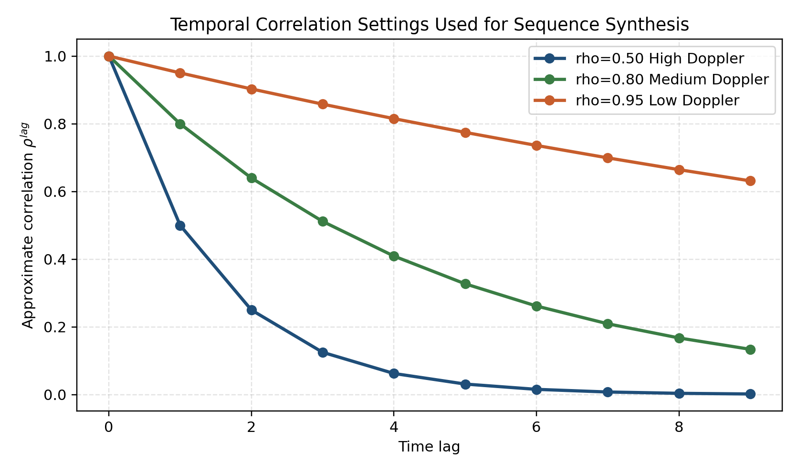
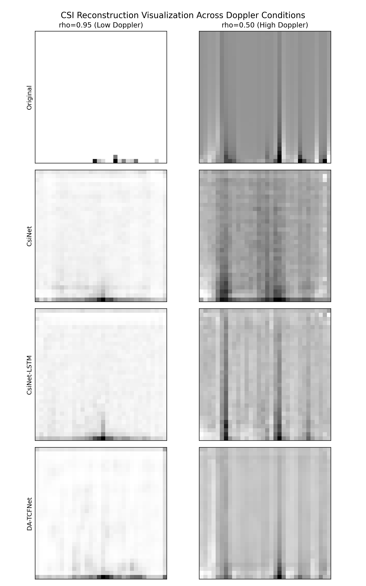

# MidTerm Extra - Architectural Innovation for Time-Varying CSI Feedback

## 1. Project Overview

This project implements the **Q7 extra credit task**, which asks for a new CSI feedback / reconstruction architecture to replace `CsiNet-LSTM`. The goal is not to rerun the original Q7 single-frame CsiNet experiment, but to design and validate a new temporal CSI feedback method that:

- effectively utilizes temporal correlation,
- reduces computational overhead on the UE side, and
- improves robustness against Doppler spread.

The proposed model in this project is **DA-TCFNet**:

`Doppler-Adaptive Temporal Convolutional Feedback Network`

Its key design principle is:

- keep the UE side lightweight and single-frame,
- move temporal modeling to the BS side,
- use a Doppler-aware fusion mechanism to control reliance on historical CSI.

## 2. Extra Credit Requirement

| Requirement | Implementation in This Project |
|---|---|
| Propose a new architecture to replace `CsiNet-LSTM`. | `DA-TCFNet` replaces recurrent temporal processing with BS-side temporal convolution and adaptive fusion. |
| Clarify which modules are on the UE and which are on the BS. | The architecture is explicitly split into UE-side compression and BS-side temporal reconstruction. |
| Discuss training strategy. | Offline pretraining, synthetic sequence generation, quantization-aware design, and BS-only adaptation are documented. |
| Design at least two ablation studies. | The implementation supports three-way comparison among `CsiNet`, `CsiNet-LSTM`, and `DA-TCFNet`. |

## 3. References

- Exercise reference code: https://github.com/le-liang/wcmlbook/tree/main/ch2/Exercise_2.15
- Official COST2100 channel model: https://github.com/cost2100/cost2100
- Q7 baseline project: `../MidTerm_Q7`
- Reference paper: `Deep_Learning-Based_CSI_Feedback_Approach_for_Time-Varying_Massive_MIMO_Channels.pdf`

## 4. Architecture Summary

The proposed system pipeline is:

$$
\mathbf{H}_t
\rightarrow
\text{angular-delay transform}
\rightarrow
\text{lightweight UE encoder}
\rightarrow
\mathbf{z}_t
\rightarrow
\text{quantization / feedback}
\rightarrow
\text{BS temporal module}
\rightarrow
\text{Doppler-aware fusion}
\rightarrow
\hat{\mathbf{H}}_t
$$

### 4.3 Model Formulation

To make the proposed architecture explicit, the main modules can be written as:

$$
\mathbf{z}_t = E_{\theta}(\mathbf{H}_t)
$$

where \(E_{\theta}\) is the UE-side lightweight encoder and \(\mathbf{z}_t\) is the compressed CSI feedback codeword.

$$
\mathbf{f}_t = T_{\phi}(\mathbf{z}_{t-L+1}, \mathbf{z}_{t-L+2}, \dots, \mathbf{z}_t)
$$

where \(T_{\phi}\) is the BS-side temporal module that extracts temporal features from the latent CSI sequence.

$$
\alpha_t = \sigma\!\left(g_{\psi}(\mathbf{z}_t, \mathbf{f}_t, \rho_t)\right)
$$

$$
\mathbf{z}_t^{\mathrm{fused}} = \alpha_t \mathbf{z}_t + (1-\alpha_t)\mathbf{f}_t
$$

where \(g_{\psi}\) is the Doppler-aware gating function and \(\rho_t\) is the temporal-correlation indicator.

$$
\hat{\mathbf{H}}_t = D_{\omega}\!\left(\mathbf{z}_t^{\mathrm{fused}}\right)
$$

where \(D_{\omega}\) is the BS-side decoder and \(\hat{\mathbf{H}}_t\) is the reconstructed CSI.

### 4.1 UE Side

The UE only performs:

- current-frame CSI preprocessing,
- lightweight latent compression,
- tiny Doppler / temporal-correlation indicator feedback.

The UE does **not** run any LSTM or temporal network. This keeps the terminal-side computation and latency low.

### 4.2 BS Side

The BS performs:

- latent memory aggregation over recent CSI frames,
- temporal modeling using a TCN-style module,
- Doppler-aware fusion between current CSI and temporal features,
- final CSI reconstruction.


## 5. Directory Structure

```text
MidTerm_Extra/
|-- README.md
|-- baselines/
|   |-- CsiNet_train.py
|   |-- CsiNet_onlytest.py
|   |-- CS-CsiNet_train.py
|   `-- CS-CsiNet_onlytest.py
|-- data/
|   |-- sequence/
|   `-- sequence_submit/
|-- docs/
|   |-- architecture.md
|   |-- training_strategy.md
|   `-- ablation_plan.md
|-- reports/
|   `-- MidTerm_Extra_Report.md
|-- result/
|   |-- submit/
|   |-- ablation_submit_triplet/
|   `-- figures_submit/
|-- saved_model/
|-- scripts/
|   |-- clean_submit_outputs.ps1
|   |-- run_make_sequence.ps1
|   |-- run_submit_100epochs.ps1
|   |-- run_train_proposed.ps1
|   |-- run_ablation.ps1
|   |-- run_plot_data_overview.ps1
|   |-- run_plot_reconstruction.ps1
|   `-- run_plot_ablation.ps1
`-- src/
    |-- data/
    |   |-- load_cost2100.py
    |   `-- make_time_sequence.py
    |-- models/
    |   |-- csinet_blocks.py
    |   |-- da_tcfnet.py
    |   |-- lstm_baseline.py
    |   |-- single_frame_baseline.py
    |   `-- tcn_block.py
    |-- utils/
    |   |-- complexity.py
    |   |-- metrics.py
    |   `-- plot_ablation_results.py
    |-- train_proposed.py
    |-- test_proposed.py
    `-- run_ablation.py
```

## 6. Original Code and New Design

### 6.1 Q7 Baseline Files

The original Q7 baseline scripts are copied into `baselines/` for reference:

| File | Function |
|---|---|
| `baselines/CsiNet_train.py` | Original CsiNet training script. |
| `baselines/CsiNet_onlytest.py` | Original CsiNet inference-only script. |
| `baselines/CS-CsiNet_train.py` | Original CS-CsiNet training script. |
| `baselines/CS-CsiNet_onlytest.py` | Original CS-CsiNet inference-only script. |

### 6.2 New Python Code

| File | Function |
|---|---|
| `src/data/load_cost2100.py` | Shared COST2100 loading utilities adapted from Q7. |
| `src/data/make_time_sequence.py` | Generates synthetic time-varying CSI sequences from Q7 COST2100 snapshots. |
| `src/models/csinet_blocks.py` | Reusable encoder / decoder blocks derived from the CsiNet idea. |
| `src/models/da_tcfnet.py` | Proposed `DA-TCFNet` model. |
| `src/models/lstm_baseline.py` | `CsiNet-LSTM`-style temporal baseline. |
| `src/models/single_frame_baseline.py` | Single-frame `CsiNet` baseline on the same generated sequence target. |
| `src/train_proposed.py` | Trains `DA-TCFNet`. |
| `src/test_proposed.py` | Evaluates saved `DA-TCFNet` weights. |
| `src/run_ablation.py` | Runs fair comparison among `CsiNet`, `CsiNet-LSTM`, and `DA-TCFNet`. |
| `src/utils/plot_data_overview.py` | Generates sequence sample-count and temporal-correlation overview figures. |
| `src/utils/plot_reconstruction_examples.py` | Generates Q7-style CSI reconstruction comparison figures for multiple models. |
| `src/utils/plot_ablation_results.py` | Generates report-style figures for ablation and training curves. |

## 7. Dataset Design

This project reuses the official COST2100 export from `MidTerm_Q7/data/cost2100_official`. Since the extra-credit task focuses on time-varying CSI, synthetic sequences are generated from static CSI snapshots using controlled temporal correlation:

$$
\mathbf{H}_t = \rho \mathbf{H}_{t-1} + \sqrt{1 - \rho^2}\,\mathbf{H}_{\mathrm{random}}
$$

The current implementation uses:

- `rho = 0.95` for low Doppler,
- `rho = 0.80` for medium Doppler,
- `rho = 0.50` for high Doppler.

This gives a controllable course-project approximation of different mobility conditions while preserving compatibility with the Q7 data pipeline.

## 7.1 Training Objective

The training objective used in this project is

$$
\mathcal{L} = \mathcal{L}_{\mathrm{rec}} + \beta \mathcal{L}_{\mathrm{temp}} + \eta \mathcal{L}_{\mathrm{rate}}
$$

where the reconstruction loss is

$$
\mathcal{L}_{\mathrm{rec}} = \frac{\|\mathbf{H}_t - \hat{\mathbf{H}}_t\|_2^2}{\|\mathbf{H}_t\|_2^2}
$$

the temporal consistency term is

$$
\mathcal{L}_{\mathrm{temp}} = \left\| (\hat{\mathbf{H}}_t - \hat{\mathbf{H}}_{t-1}) - (\mathbf{H}_t - \mathbf{H}_{t-1}) \right\|_2^2
$$

and the rate-aware term is

$$
\mathcal{L}_{\mathrm{rate}} = \|\mathbf{z}_t - Q(\mathbf{z}_t)\|_2^2
$$

This formulation is used only to define the training objective of the proposed model; it is not presented as a theorem or formal optimality proof.

## 8. How To Run

Use the same TensorFlow environment as Q7. The recommended submission configuration is:

- `time_steps = 10`
- `encoded_dim = 128`
- `epochs = 100`
- `batch_size = 64`
- `rho_list = {0.95, 0.80, 0.50}`
- `train-limit = 100`
- `val-limit = 50`
- `test-limit = 50`

Before running the commands below, activate the TensorFlow environment:

```powershell
conda activate csinet_tf
```

### 8.1 Generate Time-Varying CSI Sequences

```powershell
cd "D:\NYCU\class\Artificial Intelligence Wireless\NYCU-AI-Wireless-Communication-HW\MidTerm_Extra"
```

If you want to clean old submission outputs before rerunning, use:

```powershell
.\scripts\clean_submit_outputs.ps1
```

To execute the entire 100-epoch submission pipeline in one command, use:

```powershell
.\scripts\run_submit_100epochs.ps1
```

Then generate the temporal sequences:

```powershell
python src/data/make_time_sequence.py --input-dir ../MidTerm_Q7/data/cost2100_official --output-dir data/sequence_submit --time-steps 10 --rho-list 0.95 0.80 0.50 --train-limit 100 --val-limit 50 --test-limit 50
```

### 8.2 Train the Proposed Model

```powershell
python src/train_proposed.py --data-dir data/sequence_submit --time-steps 10 --encoded-dim 128 --epochs 100 --batch-size 64 --save-dir saved_model/proposed_submit --result-dir result/submit
```

### 8.3 Evaluate the Proposed Model

```powershell
python src/test_proposed.py --data-file data/sequence_submit/test_sequences_t10.npz --weights saved_model/proposed_submit/da_tcfnet_best.weights.h5 --time-steps 10 --encoded-dim 128 --batch-size 64
```

### 8.4 Run the Main Ablation

This compares:

- `CsiNet`
- `CsiNet-LSTM`
- `DA-TCFNet`

under the same generated sequence dataset and the same training configuration.

```powershell
python src/run_ablation.py --data-dir data/sequence_submit --time-steps 10 --encoded-dim 128 --epochs 100 --batch-size 64 --result-dir result/ablation_submit_triplet
```

### 8.5 Generate Figures

```powershell
python src/utils/plot_ablation_results.py --ablation-csv result/ablation_submit_triplet/ablation_results.csv --history-csv result/submit/history_da_tcfnet.csv --figure-dir result/figures_submit
```

Optional data-overview figures:

```powershell
python src/utils/plot_data_overview.py --data-dir data/sequence_submit --time-steps 10 --figure-dir result/figures_submit
```

Optional reconstruction visualization:

```powershell
python src/utils/plot_reconstruction_examples.py --data-file data/sequence_submit/test_sequences_t10.npz --model-dir result/ablation_submit_triplet/models --time-steps 10 --encoded-dim 128 --rho-values 0.95 0.50 --figure-dir result/figures_submit
```

## 9. Results and Figures

The following results are from the final submission configuration:

- `time_steps = 10`
- `encoded_dim = 128`
- `epochs = 100`
- `batch_size = 64`
- `rho = 0.95, 0.80, 0.50`
- `train / val / test limit = 100 / 50 / 50 per dataset`

### 9.1 Training Curve



*Figure: Training and validation loss curves of the proposed DA-TCFNet over 100 epochs.*

The `DA-TCFNet` training process converges smoothly over 100 epochs. The training loss decreases from `0.1860` to `0.000623`, while the validation loss decreases from `0.1376` to `0.000940`. 

### 9.2 Ablation NMSE Comparison



*Figure: Grouped NMSE comparison of CsiNet, CsiNet-LSTM, and DA-TCFNet under different temporal correlation settings.*

The grouped NMSE comparison shows that the three models behave differently across Doppler conditions. `DA-TCFNet` performs best at `rho = 0.50`, which corresponds to the high-Doppler setting, while `CsiNet` and `CsiNet-LSTM` are slightly stronger when temporal correlation is very high.

### 9.3 NMSE versus Temporal Correlation



*Figure: NMSE trend of the three models as the temporal correlation coefficient changes.*

The line plot makes the trend clearer:

- At `rho = 0.50`, `DA-TCFNet` achieves the best NMSE.
- At `rho = 0.80`, all three models are close, with `CsiNet-LSTM` slightly ahead.
- At `rho = 0.95`, `CsiNet` and `CsiNet-LSTM` outperform `DA-TCFNet`.

This suggests that the proposed model is especially beneficial under faster channel variation, which is consistent with the goal of improving Doppler robustness.

### 9.4 Inference Latency Comparison



*Figure: Inference latency comparison among the three competing models.*

The latency comparison confirms the expected deployment trade-off:

- `CsiNet` is the fastest baseline.
- `CsiNet-LSTM` and `DA-TCFNet` are slower because they include temporal processing.
- `DA-TCFNet` is slightly slower than `CsiNet-LSTM`, but this cost is exchanged for better robustness at low temporal correlation.

### 9.5 Sequence Design Overview



*Figure: Number of generated temporal sequences in the train, validation, and test splits.*



*Figure: Number of generated sequences under each temporal correlation setting (`rho = 0.95, 0.80, 0.50`).*



*Figure: Illustration of how the three temporal correlation settings decay with time lag.*


### 9.6 Reconstruction Visualization



*Figure: Qualitative reconstruction comparison among Original CSI, CsiNet, CsiNet-LSTM, and DA-TCFNet at different Doppler conditions.*

The reconstruction examples qualitatively show that all three models can recover the main angular-delay structure, but the relative quality changes with Doppler condition.

## 10. Numeric Results

### 10.1 Proposed Model Performance

The final `DA-TCFNet` test result is:

| Model | Time Steps | Encoded Dim | Epochs | NMSE (dB) | Cosine Similarity | Trainable Params | Inference Time / Sample (s) |
|---|---:|---:|---:|---:|---:|---:|---:|
| `DA-TCFNet` | 10 | 128 | 100 | -21.5424 | 0.996646 | 1,471,708 | 0.00141381 |

### 10.2 Three-Way Ablation

| Model | rho | NMSE (dB) | Cosine Similarity | Trainable Params | Inference Time / Sample (s) |
|---|---:|---:|---:|---:|---:|
| `CsiNet` | 0.50 | -15.0813 | 0.985575 | 1,318,114 | 0.00066901 |
| `CsiNet` | 0.80 | -27.2398 | 0.999071 | 1,318,114 | 0.00069716 |
| `CsiNet` | 0.95 | -35.5841 | 0.999874 | 1,318,114 | 0.00070372 |
| `DA-TCFNet` | 0.50 | -18.4157 | 0.993339 | 1,471,708 | 0.00148995 |
| `DA-TCFNet` | 0.80 | -27.1283 | 0.999123 | 1,471,708 | 0.00148664 |
| `DA-TCFNet` | 0.95 | -32.9461 | 0.999837 | 1,471,708 | 0.00167859 |
| `CsiNet-LSTM` | 0.50 | -16.0370 | 0.987763 | 1,482,722 | 0.00126966 |
| `CsiNet-LSTM` | 0.80 | -27.3505 | 0.999092 | 1,482,722 | 0.00126352 |
| `CsiNet-LSTM` | 0.95 | -35.3370 | 0.999873 | 1,482,722 | 0.00127245 |

## 11. Discussion

First, the proposed `DA-TCFNet` clearly improves robustness in the high-Doppler setting. At `rho = 0.50`, it achieves `-18.4157 dB`, outperforming both `CsiNet` (`-15.0813 dB`) and `CsiNet-LSTM` (`-16.0370 dB`). This directly supports the architectural motivation of reducing reliance on stale temporal information when channel variation becomes faster.

Second, the proposed method does not dominate every scenario. At `rho = 0.80`, all three models are very close, and at `rho = 0.95`, `CsiNet` and `CsiNet-LSTM` are slightly better than `DA-TCFNet`. This indicates that the current `DA-TCFNet` design is better interpreted as a robustness-oriented architecture rather than a universally best NMSE optimizer.

Third, the complexity numbers also match the intended design trade-off. `CsiNet` remains the lightest and fastest model, while `DA-TCFNet` introduces additional temporal processing cost. However, this additional cost is acceptable for a BS-heavy design, especially if the target deployment scenario values mobility robustness more than minimum latency.
