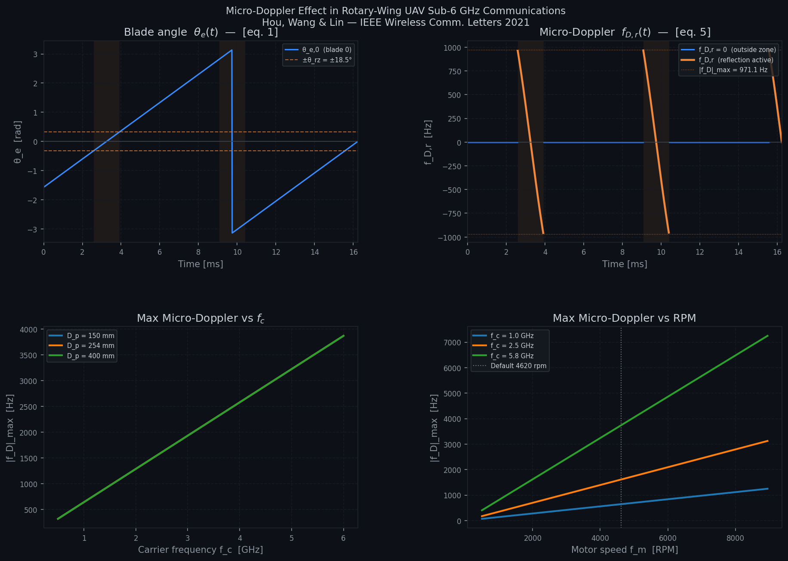
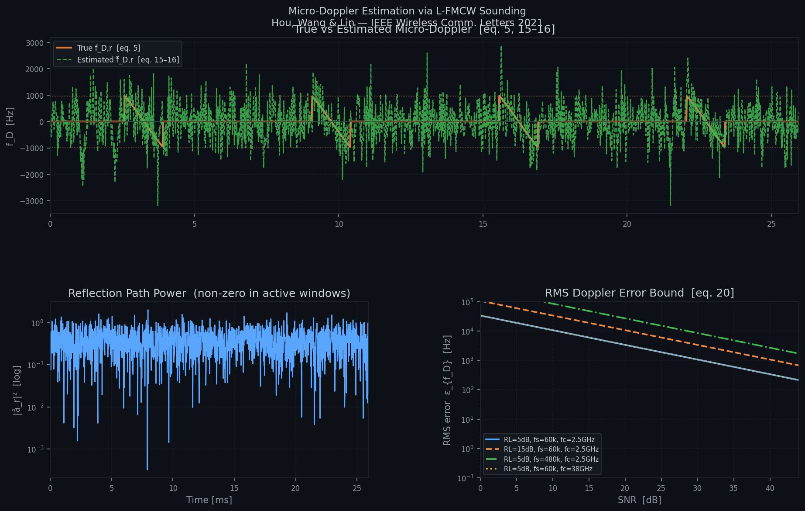

# Q2 README: Serviceability and Resilience Metrics for Rotary-Wing UAV Micro-Doppler Estimation

## 1. Objective

This work reproduces and modifies the public repository based on the paper **"Micro-Doppler Shift and Its Estimation in Rotary-Wing UAV Sub-6 GHz Communications"** to answer **Q2: Serviceability and Resilience Metrics**.

The goal is to:

1. run the original micro-Doppler channel and estimation programs,
2. modify the estimation script to match the Q2 scenario,
3. derive the serviceability violation probability from the paper's RMS-error formula,
4. compute the network resilience index for a 10-UAV swarm with a 7-out-of-10 serviceability requirement,
5. compare the program output with the hand-derived results.

---

## 2. Reference Papers

### Primary paper

H.-A. Hou, L.-C. Wang, and H.-P. Lin, **"Micro-Doppler Shift and Its Estimation in Rotary-Wing UAV Sub-6 GHz Communications,"** *IEEE Wireless Communications Letters*, vol. 10, no. 10, pp. 2185-2189, Oct. 2021.

### Resilience context paper

H. Peng and L.-C. Wang, **"Unmanned Aerial Vehicles Assisted Resilient Communications: Challenges and Opportunities,"** *ICNC 2026 Invited Talk Paper*, 2026.

---

## 3. Repository Used

GitHub repository:

```text
https://github.com/aiwireless-535100/Micro-Doppler-Shift_Rotary-Wing-Sub6Ghz
```

Main files used in this homework:

- `microdoppler_channel.py`  
  Generates the physical micro-Doppler model and analytical plots.
- `microdoppler_estimation.py`  
  Implements the L-FMCW estimation pipeline and the RMS Doppler error bound.
- `figure/microdoppler_results.png`  
  Generated by `microdoppler_channel.py`.
- `figure/microdoppler_estimation_results.png`  
  Generated by `microdoppler_estimation.py`.

---

## 4. Environment and Execution

### 4.1 Python environment

The scripts were executed in a Python virtual environment with the required packages:

```bash
pip install numpy scipy matplotlib
```

### 4.2 Original execution

```bash
python microdoppler_channel.py
python microdoppler_estimation.py
```

### 4.3 Output files

The repository successfully generated:

- `figure/microdoppler_results.png`
- `figure/microdoppler_estimation_results.png`

---

## 5. Q2 Scenario Required by the Homework

The homework specifies the following low-SNR setting:

- **SNR = 10 dB**
- **Sampling rate** $f_s = 60$ kSPS
- **Return loss** $RL = 5$ dB
- **Critical threshold** $\Gamma = 50$ Hz

The network is defined as serviceable if the micro-Doppler estimation error remains below the threshold. The swarm resilience condition is:

- number of UAVs: $n = 10$
- minimum serviceable UAVs: $k = 7$

---

## 6. Program Modification

The repository default setting in `microdoppler_estimation.py` was modified to match the Q2 condition.

### 6.1 Parameter modification

```python
p["SNR"] = 10.0
p["fs"] = 60e3
p["RL"] = 5.0
```

### 6.2 Additional Q2 metric calculation

The following code block was added to compute the derived Q2 metrics:

```python
Gamma = 50.0   # serviceability threshold [Hz]

# Use theoretical RMS error bound as sigma
sigma = bound_Hz

# One-sided Gaussian tail: P(epsilon > Gamma)
p_fail = 0.5 * math.erfc(Gamma / (sigma * math.sqrt(2.0)))
p_serv = 1.0 - p_fail

# k-out-of-n resilience: n=10, k=7
n_uav = 10
k_req = 7
R_sys = sum(
    math.comb(n_uav, i) * (p_serv ** i) * ((1 - p_serv) ** (n_uav - i))
    for i in range(k_req, n_uav + 1)
)
```


## 7. Mathematical Derivation

### 7.1 RMS error bound from the paper

From Eq. (20) in the paper:

$$
10\log_{10} E\left(|\varepsilon_{f_D,r}[n]|^2\right)
< 20\log_{10}\left(\frac{f_s}{\pi}\right) + RL - SNR
$$

Substituting the homework setting:

$$
f_s = 60 \times 10^3,\quad RL = 5,\quad SNR = 10
$$

we obtain

$$
10\log_{10} E\left(|\varepsilon_{f_D,r}[n]|^2\right)
< 20\log_{10}\left(\frac{60000}{\pi}\right) + 5 - 10
\approx 80.62\ \text{dB}
$$

Convert to linear scale:

$$
E\left(|\varepsilon_{f_D,r}[n]|^2\right)
< 10^{80.62/10}
\approx 1.153346 \times 10^8\ \text{Hz}^2
$$

Therefore,

$$
\sigma = \sqrt{E\left(|\varepsilon_{f_D,r}[n]|^2\right)}
\approx 10739.93\ \text{Hz}
$$

### 7.2 Serviceability violation probability

The homework assumes

$$
\varepsilon_{f_D,r} \sim \mathcal{N}(0,\sigma^2)
$$

Following the problem statement, the violation event is taken as the **one-sided** event

$$
P_{\text{fail}} = P(\varepsilon_{f_D,r} > \Gamma)
$$

with

$$
\Gamma = 50\ \text{Hz}
$$

Thus,

$$
P_{\text{fail}} = Q\left(\frac{\Gamma}{\sigma}\right)
= Q\left(\frac{50}{10739.93}\right)
= Q(0.004655)
\approx 0.498143
$$

So the single-UAV serviceability probability is

$$
P_{\text{serv}} = 1 - P_{\text{fail}}
\approx 0.501857
$$

### 7.3 Network resilience index

Let

$$
X \sim \text{Binomial}(n=10,\ p=P_{\text{serv}})
$$

The network is resilient if at least 7 UAVs remain serviceable:

$$
R_{\text{sys}} = P(X \ge 7)
= \sum_{i=7}^{10} \binom{10}{i} P_{\text{serv}}^i (1-P_{\text{serv}})^{10-i}
$$

Substituting

$$
P_{\text{serv}} = 0.501857
$$

we obtain

$$
R_{\text{sys}} \approx 0.174939
$$

Hence,

$$
R_{\text{sys}} \approx 17.49\%
$$

---

## 8. Simulation Results

### 8.1 Channel-model validation result

Running `microdoppler_channel.py` produced the following validation results under the default physical parameters:

- $|f_D|_{\max} = 971.07$ Hz
- expected value from the paper/repository: approximately $963$ Hz
- blade period: $6.494$ ms
- reflection duration: $1.336$ ms

These values are close to the paper's reference values and confirm that the channel model is implemented correctly.

### 8.2 Estimation result for Q2 condition

Running the modified `microdoppler_estimation.py` produced:

- **Theoretical RMS error bound**: $10739.93$ Hz
- **Simulated RMS error (in active zone)**: $674.64$ Hz
- **Serviceability violation probability**: $49.81\%$
- **Single-UAV serviceability probability**: $50.19\%$
- **Network resilience index**: $17.49\%$

### 8.3 Interpretation

The theoretical RMS bound is much larger than the simulated RMS error because Eq. (20) provides an **upper bound**, not an exact equality. The simulation result remains below the bound, which is expected.

Under the low-SNR setting, the error distribution relative to the threshold $\Gamma = 50$ Hz yields a failure probability close to 0.5. Therefore, a 10-UAV network requiring at least 7 serviceable UAVs has only about **17.49% resilience**, indicating weak robustness in this low-SNR scenario.

---

## 9. Figures

### Figure 1. Physical micro-Doppler model



This figure shows:

- blade angle $\theta_e(t)$,
- instantaneous micro-Doppler $f_{D,r}(t)$,
- maximum micro-Doppler versus carrier frequency,
- maximum micro-Doppler versus motor RPM.

### Figure 2. L-FMCW estimation and error-bound result



This figure shows:

- true vs estimated micro-Doppler,
- reflection-path power,
- RMS Doppler error bound versus SNR for multiple parameter settings.

---

## 10. Hand Calculation vs Program Output

| Item | Hand calculation | Program output | Consistent? |
|---|---:|---:|---|
| RMS bound $\sigma$ | 10739.93 Hz | 10739.93 Hz | Yes |
| $P_{\text{fail}}$ | 0.4981 | 0.498143 | Yes |
| $P_{\text{serv}}$ | 0.5019 | 0.501857 | Yes |
| $R_{\text{sys}}$ | 0.1750 | 0.174939 | Yes |

The hand-derived results and the modified program output match closely, confirming that the implementation and the mathematical derivation are consistent.

---

## 11. Conclusion

The original repository already provides the channel model, L-FMCW estimation pipeline, and RMS error bound. After modifying the SNR, sampling rate, and return-loss parameters to match the homework condition, and after adding the Gaussian-tail and binomial-resilience calculations, the final results are:

- $\sigma = 10739.93$ Hz
- $P_{\text{fail}} \approx 49.81\%$
- $P_{\text{serv}} \approx 50.19\%$
- $R_{\text{sys}} \approx 17.49\%$

Therefore, under the specified low-SNR condition, the rotary-wing UAV communication link has weak serviceability, and the 10-UAV swarm provides limited resilience when at least 7 serviceable UAVs are required.
